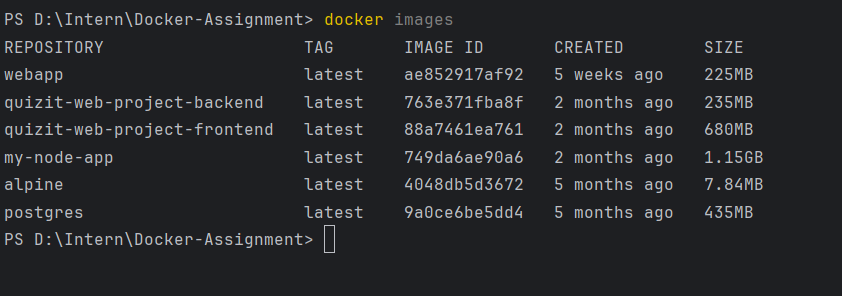
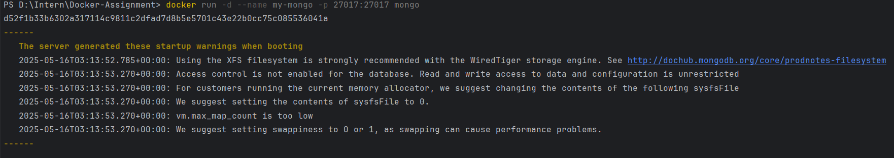

## Docker Commands Used

### 1. Build the JAR file
```bash
mvn clean package
```

### 2.Run the Generated JAR File
```bash
cd target
java -jar Docker-Assignment-1.0-SNAPSHOP.jar
```

### 3. Create a Dockerfile

### 4.Build the Docker Image
```bash
docker build -t docker-assignment .
```


### 5.Run the Docker Image
```bash
docker run docker-assignment .
```


### 6. List All Docker Images
```bash
docker images
```


### 7. Remove the Docker Image
```bash
docker ps -a
docker stop 440967e2b869
docker rm 440967e2b869
docker rmi docker-assignment
```

### 8.Run the Docker Image
```bash
docker images
```


### 9. Pull the Hello World Image
```bash
docker pull hello-world
```


### 10. Run Hello World
```bash
docker run hello-world
```


### 11. List Docker Images Again
```bash
docker images
```


### 12.Pull and Run MongoDB as Docker Container
```bash
docker pull mongo
docker run -d --name my-mongo -p 27017:27017 mongo
```



### 13. Open Mongo Shell
```bash
docker exec -it my-mongo mongosh
show dbs
```


